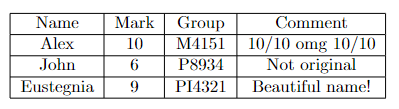

# Homework 2

Необходимо реализовать генератор LaTeX в функциональном стиле. Для генерации латеха нельзя использовать сторонние библиотеки.

## Task 2.1
Написать функцию для генерации таблиц (кода .tex). На вход поступает двойной список, на выходе строка с отформатированным валидным латехом. Проверить, что латех валидный можно, например, в Overleaf.
Используя другой модуль (.py файл) нужно импортировать вашу функцию и используя ее необходимо сохранить в .tex файл.Пример работы этой функции, это и будет артефактом для этой задачи.

Запуск: `python main.py`

Исходный код: [main.py](task_1/main.py) [latex_generator.py](task_1/latex_generator.py)

Артефакты: [здесь](task_1/artifacts)

Пример вывода: [table.tex](task_1/artifacts/table.tex)

Валидация на Overleaf:

## Task 2.2
Написать функцию для генерации картинок в латех. (В том же модуле что и предыдущую функцию)
В качестве картинки использовать любую картинку (png файл), НО:
Нужно собрать ваш код в библиотеку при помощи setuptools/conda-build, выложить в репозиторий
Установить вашу библиотеку.
После этого, используя вашу библиотеку, сгенерировать по полученному латеху PDF с таблицей из задачи 2.1 и картинкой. PDF -  первый артефакт задачи, ссылка на репозиторий в PyPI/Anaconda - второй.
Генерировать pdf можно при помощи pdflatex.

Ссылка на PyPI: https://test.pypi.org/simple/

Установка: `pip install -i https://test.pypi.org/simple/ latex-generator-sesorov==1.0.0`

PDF: [здесь](task_2/artifacts/table.pdf)

Другие артефакты: [здесь](task_2/artifacts)

## Task 2.3
Скорее всего, для задачи 2.2 вы руками установили какие-то бинарные зависимости латеха. Если другой разработчик захочет переиспользовать ваш код, то ему придется проделать тоже самое. Чтобы этого избежать, обычно используют Docker. 
Задача - написать Dockerfile, в котором будут устанавливаться зависимости, запускаться ваш код (для генерации .tex), а затем генерироваться pdf.
Артефактом будет сам Dockerfile, его можно оставить в папке hw02. Да, можно использовать docker compose

Dockerfile: [здесь](task_3/Dockerfile)

Пояснение: для ускорения используется Image на основе ubuntu:bionic, так как там предустановлен латекс.
